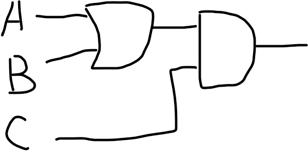
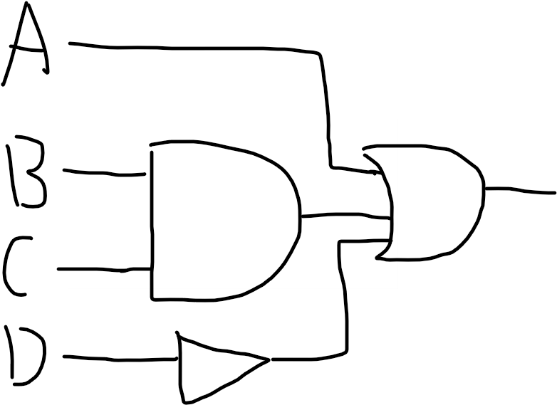
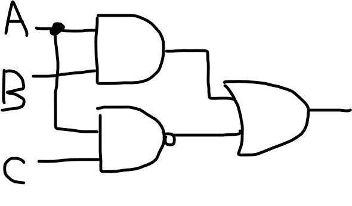
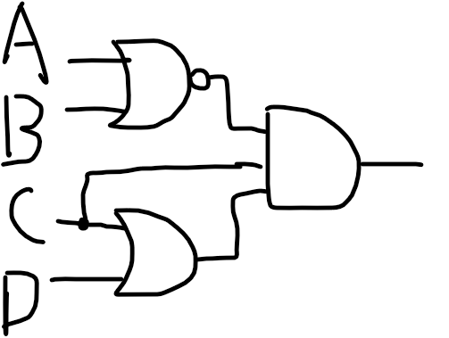
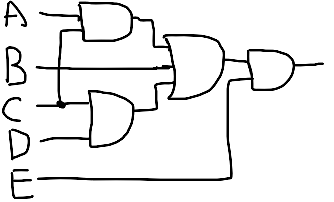
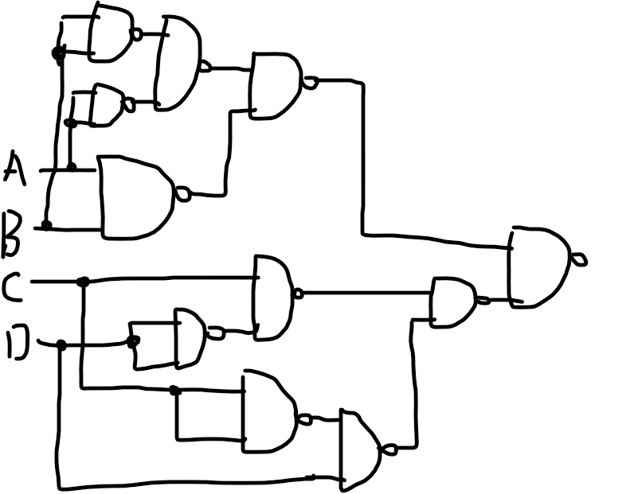
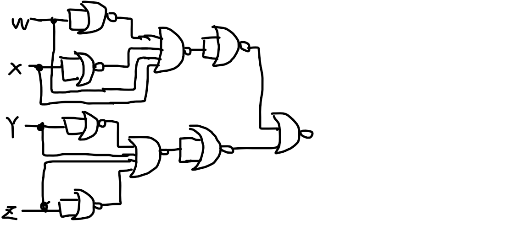

# 1

## a.

## b.

## c.

## d.

## e.

# 2

## a.

$\neg((A\and B)\or\neg(C\and D))$

## b.

$\neg(A\and B\and (C\or D))\and E $

## c.

$(A\and B\and \neg C)\or(D\and\neg(A\and B)\or(\neg B\and \neg C\and D))$

## d.

$\neg((A\and B)\and(A\or B))$

## e.

$\neg((A\and C)\and \neg(A\or\neg B\or C))\or C$

# 3

$$
\begin{align*}
&=(AB+A'B')(CD'+C'D)\\
&=((AB)'(A'B')')((CD')'(C'D)')
\end{align*}
$$

# 4

| WX\YZ | 00   | 01   | 11   | 10   |
| ----- | ---- | ---- | ---- | ---- |
| 00    | m0   |      | m3   |      |
| 01    |      |      |      |      |
| 11    | m12  |      | m15  |      |
| 10    |      |      |      |      |

$$
\begin{align*}
&=W'X'Y'Z'+WXY'Z'+W'X'YZ+WXYZ\\
&=(W'X'+WX)(Y'Z'+YZ)\\
&=(((W+X)+(W'+X'))+((Y+Z)+(Y'+Z')))'
\end{align*}
$$

