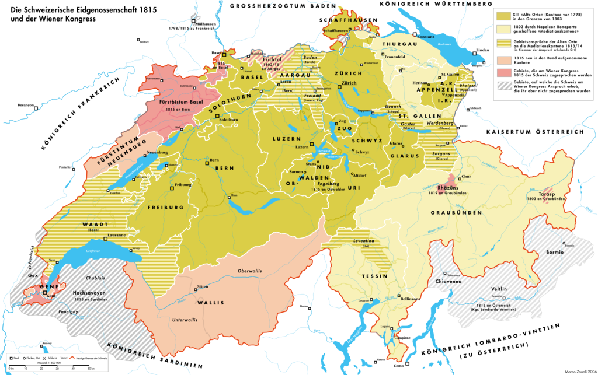
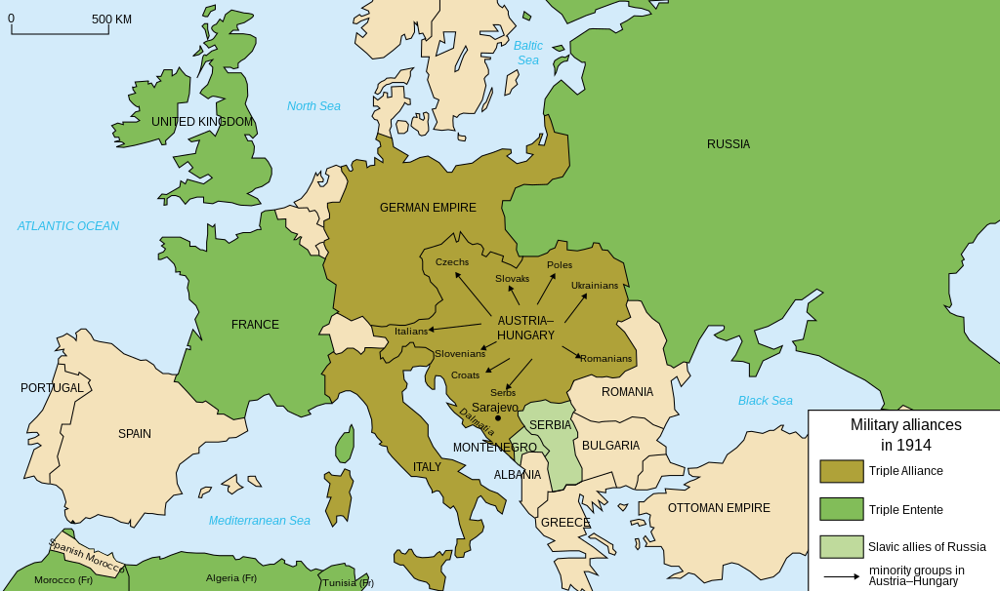
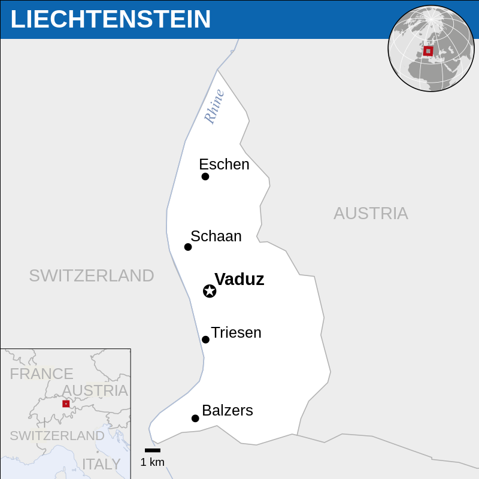
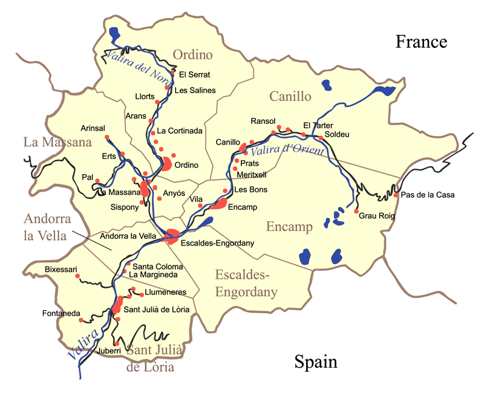
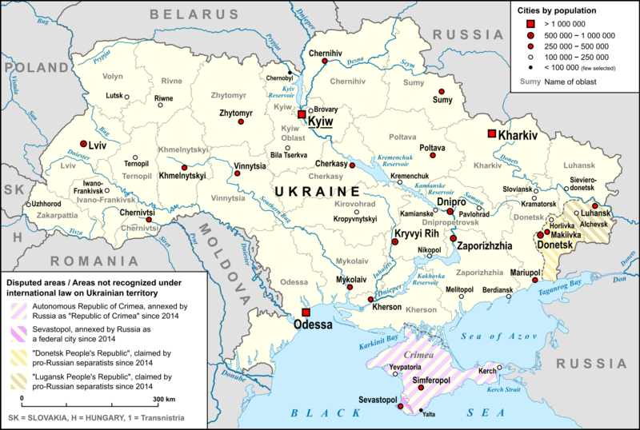
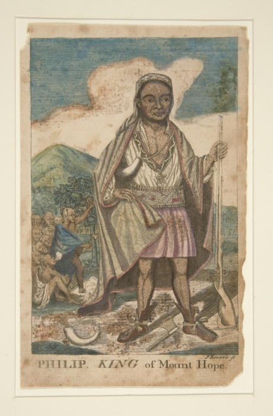
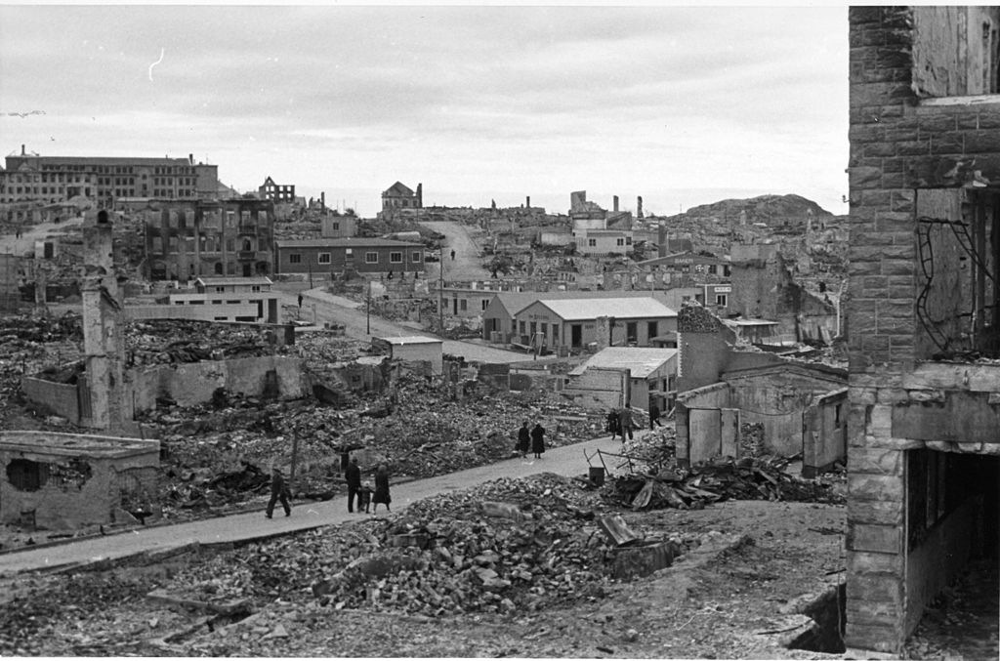
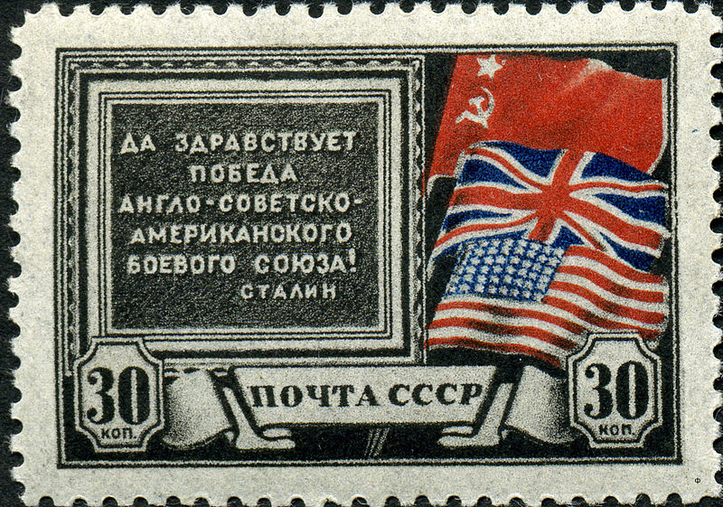

   
  
      
  <h1>Booklet of presentation 2</h1> 
  <h2>NEUTRAL COUNTRIES SHOULD NOT STAY “NEUTRAL” ALL THE TIME</h2>
    
  <h3>GLT1027 Advanced Oral Communication</h3>
    
  <h4>Name: %%%</h4>
  <h4>Matric NO.: %%%</h4>
  <h4>Occurence Group: %%%</h4>
  <h4>Lecturer: %%%</h4>

# Contents

[toc]

# Speech Outline
## Leading

In the Russia-Ukraine War, the permanent neutral county Switzerland adopted sanctions imposed by the EU against Russia. Switzerland has previously only put in place sanctions created by the United Nations Security Council. 

Many countries and people claim that the sanction is not neutral, while the president of Switzerland declare it as a Switzerland type of neutral. But and the rights and duties of neutral countries which have already written in Convention de La Haye, proofed neutral countries can be “not neutral”.

So what do "neutral" really means to neutral countries? What do we, and the global society really expect them to do when these countries claim themselves as neutral?

To find this we should first when and why neutral countries come to exist and what's their role.

## The beginning of Neural Countries

### Switzerland

The first neutral country is Switzerland, and its military neutrality was established by the Treaty of Paris in 1815. The Treaty, claimed that all the signatory states will promise and ensure Switzerland's border inviolability and also its interdependency, in return, Switzerland promised to stay neutral in future conflicts. 

Back in Congress of Vienna in 1814, those European powers agreed that Switzerland should be neutral to solve those issues arose from the French Revolutionary Wars and the Napoleonic Wars without using military violence. Switzerland is one of the key to resize those main powers like France, Austria and Prussia so that they could balance each other and remain peace. Since Switzerland is at the heart of Europe and border with France, Austria and Prussia, it's unacceptable for all of them  to see Switzerland being controlled or allied by any country. 

Yet, at that time, the Napoleonic Wars were still continuing, thus the neutrality of Switzerland is still pending where coalition forces need to cross Switzerland to attack France.

In 1889, under the threat by Russia, German and Austria to rescind the neutrality granted by other nations, and also under the pressure of Switzerland socialism and anarchism, Paul Schweizer claimed that Switzerland has a tradition of stay neutral, and he showed that Switzerland does not owe its neutrality to those great power in this writings.

The history proved that the choice of being neutral is right for Switzerland. 

In the Second Italian War of Independence, when the Kingdom of Sardinia allied with France, fight against Austria, Switzerland used its right as a armed neutral country for the first time. Switzerland occupied the nearby regions, Chablais and Faucigny, in order to protect its neutrality. And the same strategy, called "Border Occupation", will be used in the coming world war again to protect Switzerland .

In the First World War, Switzerland used its right as a armed neutral country, and Started “Border Occupation”. Switzerland occupied all the borderline and started to build fortress along them, numerous fortresses and fortifications make it nearly impossible for Germany, France, Italy or any of the countries to invade Switzerland. 

In the Second World War, Switzerland used the same strategy again to protect it's territory. Switzerland army fortified the old fortress. Because of this, Adolf Hitler,the dictator of Germany finally announced that he will  respect the neutrality of Switzerland in 1937.

### Hague Conventions

In the Second Hague Convention in 1907, the rights and duties of neutral countries are confirmed.

### Liechtenstein

Liechtenstein had became neutral because the military was dissolved since 1868. As a country so small that it has nearly no ability to resist any invade. 

In the Second World War, Liechtenstein turned to Switzerland, which is also a neutral country, for assistance and guidance. Family treasures from dynastic lands and possessions in Bohemia, Moravia and Silesia were taken to Liechtenstein for safekeeping. Together with the help of Switzerland the neutrality of Liechtenstein protected itself.

### Andorra

Andorra announced its neutrality in 1914.

In the Second World War, Andorra remained neutral and was an important smuggling route between Vichy France and Francoist Spain,fascist states. And Andorra government and some organizations sometimes even helped the Nazi to oppress the victims. But General Council members justified the council's political and diplomatic actions as necessary for Andorra's survival and the protection of its sovereignty.

### Neutral countries in Russian-Ukraine War

Ukraine declared it had the "intention of becoming a permanently neutral state that does not participate in military blocs and adheres to three nuclear free principles" in its Declaration of Sovereignty in 1990. The 1996 Ukrainian Constitution, based upon the Declaration of Independence of August 24, 1991, contained the basic principles of non-coalition and future neutrality. Such policy of state non-alignment was re-confirmed by law in 2010.

In 2014 Ukrainian Revolution, Russia annexed Crimea. And of course, Ukraine lost its neutrality due to the war. Since then, lots of countries have put in place sanctions created by the United Nations Security Council including neutral countries and countries "claim to be neutral".

After the war situation escalated into total invasion after 24 February 2022,  Switzerland adopted sanctions imposed by the EU against Russia, which much severe than the sanction created by United Nations Security Council.

## Statements

Knowing the basic history of neutral countries, Here Come to my Points.

### Neutral countries should not stay neutral except military

Well, according to my research, there are still a large percent of people think that Neutral Countries should stay neutral in all areas. I can say, that's a very dangerous idea and sometimes can lead to a certain death. 

According to Hague Convention and all the former practise of neutrality, we can get a conclusion easily, neutral countries could not really protect themselves though just announcing themselves as neutral. Andorra claimed itself as neutral country, but it was still facing the Nazi's threat and was forced to submit to Nazi's will.

And some time, things can be even worse. When the King Philip's War  between Wampanoag and Massachusetts colonists broke out, Narragansett declared their neutrality in the war and did not help any side of them. However, To the greed of those colonists, the neutrality of Narragansett did not work and soon Narragansett was destroyed after Wampanoag. 

Similarly, Norway proclaimed its neutrality during the Second World War. However, it was still invaded by German forces in 1940. Norway's unprepared for the surprise attack finally lead to a certain defeat. Norway was quickly forces to surrender on June after losing the support from Britain. 

The history proved that neutrality surely not a ultimate safety announcement. The invaders just don't care whether a country is neutral or not, they judge it profitable or not. Neutral Countries won't be safer than those chose resistance. Is all the efforts in military, economy and diplomacy works. Think about it, what if Switzerland did not build fortifications along the borderline? What will  happen if Norway had prepared well like Switzerland did?

Neutral by no means is equal to safety, only countries with the power to guarantee its neutral, can stay neutral, and this needs efforts in economy, diplomacy and some time military.

### Neutral don’t mean do nothing at all

Neutral also not means easier or less affairs, in some cases neutral countries have to do more. Just as abstain from voting is also considered as a vote, neutral also shows its attitude. And of course, once a country showed the attitude, and it has to take responsibility for it.

Especially for those neutral countries near or even border with one of more of those belligerent countries and those have coast line. 

For those armed neutral country, and also League of Armed Neutrality, they are still facing  the threat from belligerent countries, since these neutral countries will be a massive obstacle for belligerent countries to imply trade Interdiction.

The First League of Armed Neutrality was an alliance of minor naval powers organized in 1780 by Catherine II of Russia to protect neutral shipping during the American Revolutionary War. 

Under the protection of Russia empire, Denmark–Norway Kingdom, Finland and Sweden were able to ensure their neutrality during the war. The league become even stronger after Prussia, Austria and Portugal joined the league in 1782, later in 1782, the Ottoman Empire; and in 1783, the Kingdom of Naples. 

The League successfully stopped the Great Britain from expanding the war and protected the rest of the world from trade Interdiction.

However, The Second League of Neutrality was not much successful at all. During the French Revolutionary War, Denmark-Norway, Prussia, Sweden and Russia formed the alliance. However,the British government, not yet anxious to preserve Russian goodwill, openly considered it a form of alliance with France and attacked Denmark, destroying parts of its fleet in the First Battle of Copenhagen and forcing it to withdraw from the League. Britain also occupied the Danish West Indies between March 1801 and April 1802.

After the attack of Denmark, the rest members of the league either joined the French Revolutionary war against Britain or French and the league quickly collapse 

As it's confirmed in the fifth Hague Conventions in 1907, although neutral countries don't need to face "punishment" if they were forced to break convention, yet it's still quite indistinct to judge which is "forced" or not. 

As Andorra faced during and after the First World War, General Council members justified the council's political and diplomatic actions as necessary for Andorra's survival and the protection of its sovereignty. Many Andorrans and other countries as well as some organizations criticized the passivity of the General Council for impeding both the entry and expulsion of foreigners and refugees, committing economic crimes, reducing the rights of citizens and sympathy with Francoism. So, did Andorra lost its neutrality during the Second World War? 

It's hard to tell.

### Neutral don’t stand against mankind’s conscience

Nowadays, many people criticize neutrality, thinking neutrality is just another kind of appeasement. They think if America and Britain could give up its neutrality right after the Second World War erupted, the Allies could end the war faster and less people would die.

Some may say, if all the major power declared their neutrality in the Second World War, Adolf Hitler should already build his German Reich and his crazy idea of  "Thousand-Year Reich" may really come true. They think neutral as connivance.

Well, although neutral seems take nearly no effects to influence the war, neutral still provides a shelter for those small countries, and they still keep the right to interact with the rest of the world. Just as Those neutral countries in the First League of Neutrality acted during American Revolutionary War, staying neutral is still considered as an effort to  curb violence.

For those major powers, it's a kind of irresponsibility to declare neutral when such thing happens. While for small countries, they do not have the ability to stop such threat, neutral is still a good choice to archive "don't be evil".

## Conclusion

# Reference

- Convention (V) respecting the Rights and Duties of Neutral Powers and Persons in Case of War on Land. The Hague, 18 October 1907.

  

- Davies, Norman (2006), *Europe at War 1939–1945: No Simple Victory*. London: Macmillan. ISBN 0-333-69285-3

  

- Lottaz, Pascal; Reginbogin, Herbert (2019). Notions of Neutralities. Lanham: Lexington. ISBN 978-1-4985-8226-1.

  

- Switzerland, National Socialism and the Second World War. Final Report of the Independent Commission of Experts Switzerland, Pendo Verlag GmbH, Zürich 2002, ISBN 978-3-85842-603-1

  

-  "Entrevista a Enric Melich Gutiérrez, maquis de la resistència francesa, passador de jueus i clandestins, activista anarquista, llibreter i sindicalista – En contra". Blocs de VilaWeb. 21 July 2012.

   

-  "L'Andorra "fosca " i l'Andorra "generosa " durant la Segona Guerra Mundial Claudi Benet i Mas". Publicacions.iec.cat. Archived (PDF) from the original on 9 October 2022.

   

- Armed Neutralities – International maritime law in the eighteenth century(https://www.americanforeignrelations.com/A-D/Armed-Neutralities-League-of-the-armed-neutrality.html)

