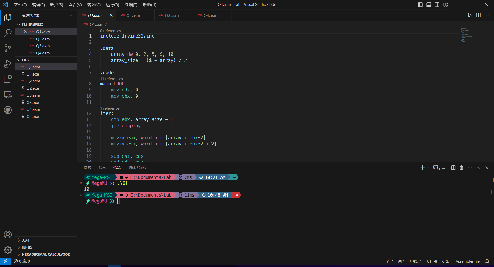
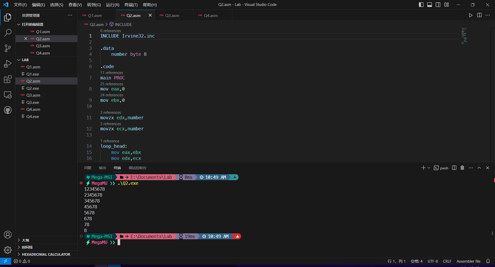
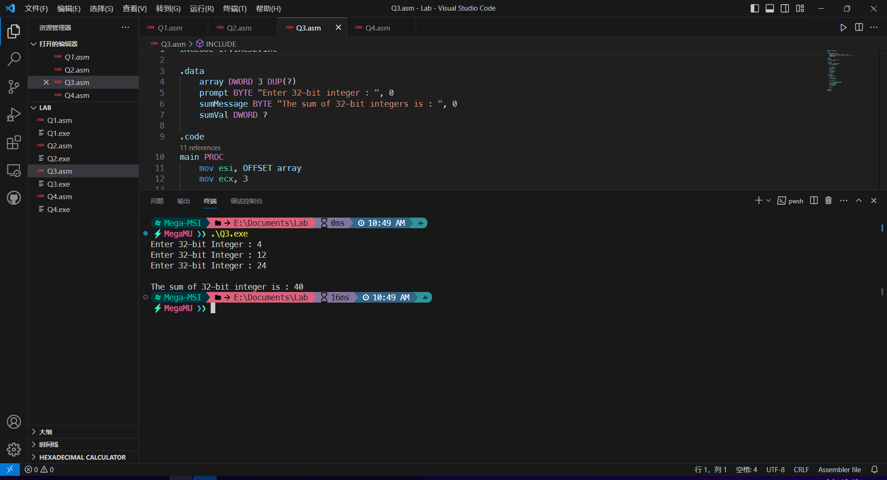
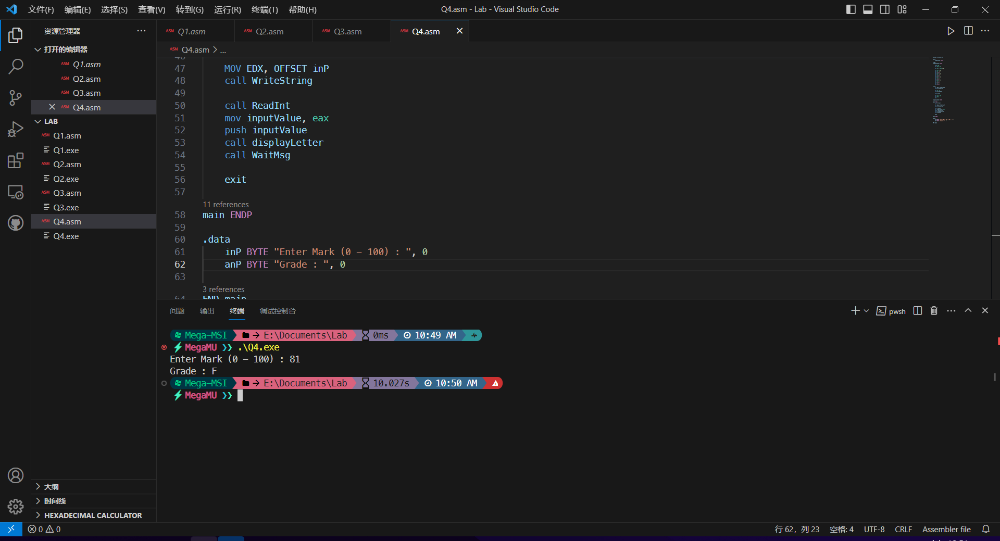

# Lab Assignment

- Wang Tianren
- s2187783

## Task 1

~~~assembly
include Irvine32.inc

.data
    array dw 0, 2, 5, 9, 10
    array_size = ($ - array) / 2

.code
main PROC
    mov edx, 0
    mov ebx, 0

iter:
    cmp ebx, array_size - 1 
    jge display        
    
    movzx eax, word ptr [array + ebx*2] 
    movzx esi, word ptr [array + ebx*2 + 2]   

    sub esi, eax        
    add edx, esi       

    inc ebx             
    jmp iter

display:
    call DumpRegs       
    call WaitMsg        
    exit                

main ENDP

END main
~~~

## Task 2

~~~assembly
INCLUDE Irvine32.inc

.data
    number byte 8

.code
main PROC
mov eax,0
mov ebx,0

movzx edx,number 
movzx ecx,number 

loop_head:
    mov eax,ebx
    mov edx,ecx

iter:
        inc eax
        call WriteDec
        dec edx
        jnz iter

        call Crlf
        inc ebx
        dec ecx
        jnz loop_head
exit
main ENDP

END main
~~~

## Task 3

~~~assembly
INCLUDE Irvine32.inc

.data
    array DWORD 3 DUP(?)
    prompt BYTE "Enter 32-bit integer : ", 0
    sumMessage BYTE "The sum of 32-bit integers is : ", 0
    sumVal DWORD ?

.code
main PROC
    mov esi, OFFSET array
    mov ecx, 3 

inputLoop:
    mov edx, OFFSET prompt
    call WriteString

    call ReadInt
    mov [esi], eax      
    add esi, 4
    dec ecx
    jnz inputLoop
    mov eax, 0              
    mov ecx, 3

calcSumLoop:
    sub esi, 4
    add eax, [esi]
    dec ecx
    jnz calcSumLoop

    mov sumVal, eax

    mov edx, OFFSET sumMessage
    call WriteString
    mov eax, sumVal
    call WriteInt           
    call Crlf            

    exit

main ENDP
END main
~~~

## Task 4

~~~assembly
INCLUDE Irvine32.inc

.data
    inputValue DWORD ?

.code
displayLetter PROC

    push ebp
    mov ebp, esp

    mov eax, [ebp + 8]
    
    cmp eax, 90           
    mov al, 'A'
    jmp print
    cmp eax, 80
    mov al, 'B'
    jmp print
    cmp eax, 70
    mov al, 'C'
    jmp print
    cmp eax, 60
    mov al, 'D'
    jmp print
    mov al, 'F'
    jmp print 

print:    
    mov EDX, OFFSET anP
    call WriteString

    mov dl, al
    call WriteChar

    call CrLf

    mov esp, ebp
    pop ebp
    ret

displayLetter ENDP

main PROC
    call Clrscr

    MOV EDX, OFFSET inP
    call WriteString
    
    call ReadInt
    mov inputValue, eax
    push inputValue
    call displayLetter
    call WaitMsg
    
    exit

main ENDP

.data
    inP BYTE "Enter an integer value between 0 and 100: ", 0
    anP BYTE "Grade:", 0

END main
~~~

