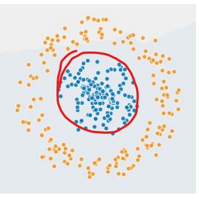

# Tutorial 2

## 1

- Transparency: AI systems are increasingly being used in various domains, such as healthcare, finance, and criminal justice. It's important to understand how these systems make decisions and what factors they consider to ensure fairness, accountability, and transparency.

- Bias and Ethics: AI systems can inadvertently learn biases from the data they are trained on, leading to unfair or discriminatory outcomes. By understanding how AI systems work, we can identify and mitigate such biases to ensure that the technology is used ethically and responsibly.

- Debugging and Improvements: Understanding AI systems allows us to identify and fix errors or issues that may arise during deployment. It enables us to debug and improve the system's performance, making it more accurate, reliable, and efficient.

- Trust and Adoption: When people understand how AI systems operate, they are more likely to trust and adopt the technology. Transparency and understanding help build confidence in AI, fostering acceptance and widespread adoption across various sectors.

## 2

 - Nonlinearity: Activation functions introduce nonlinearity to the neural network, allowing it to learn complex patterns and make nonlinear mappings between inputs and outputs. Without activation functions, a neural network would be reduced to a linear transformation, severely limiting its expressive power.

 - Gradient Propagation: During the training process, neural networks use backpropagation to update their weights based on the error signal. Activation functions play a crucial role in propagating the gradients backward through the network, enabling efficient learning and convergence.

 - Decision Boundary Flexibility: Activation functions determine the shape and flexibility of the decision boundaries learned by the neural network. Different activation functions have different characteristics, allowing the network to model different types of data distributions and make appropriate classifications.

 - Normalization: Activation functions can normalize the output of a neuron, constraining it within a specific range. This can help stabilize training by preventing extremely large or small activations, improving the overall performance and convergence of the network.

## 3

## 4

3
