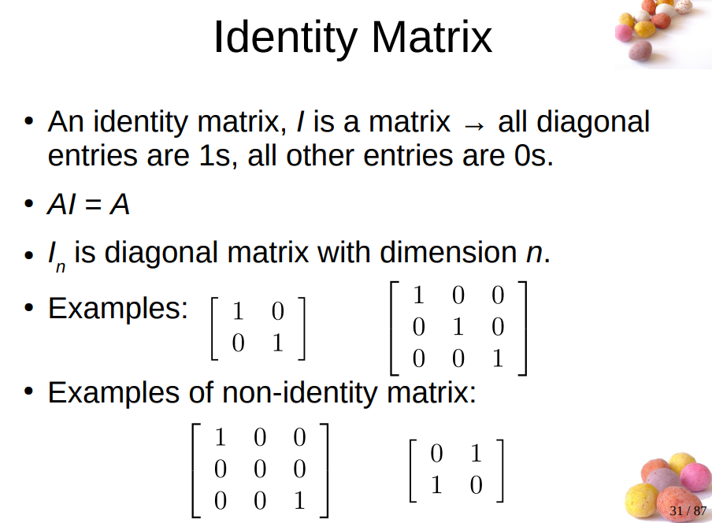
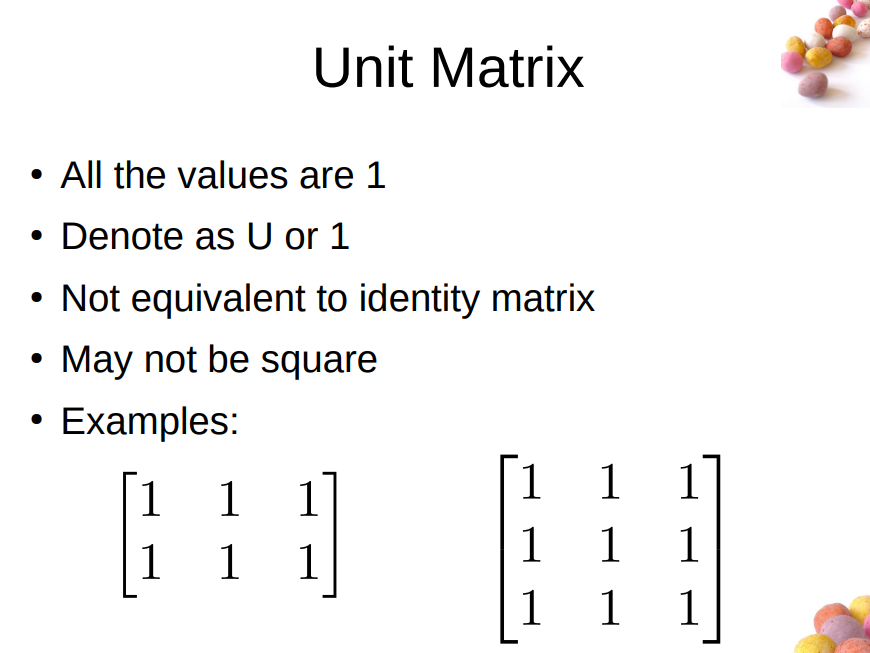
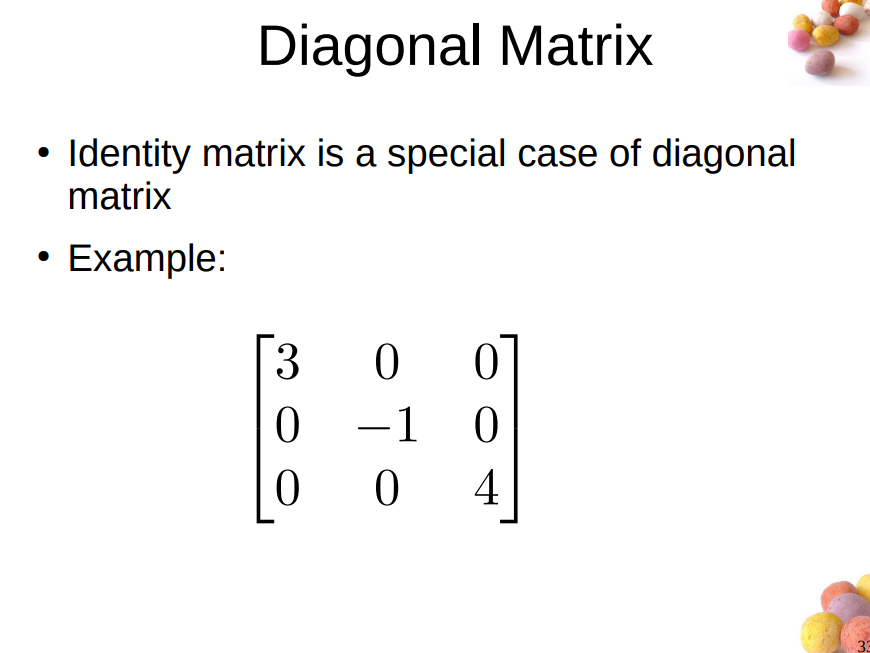
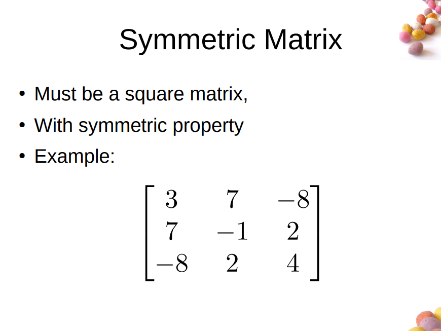
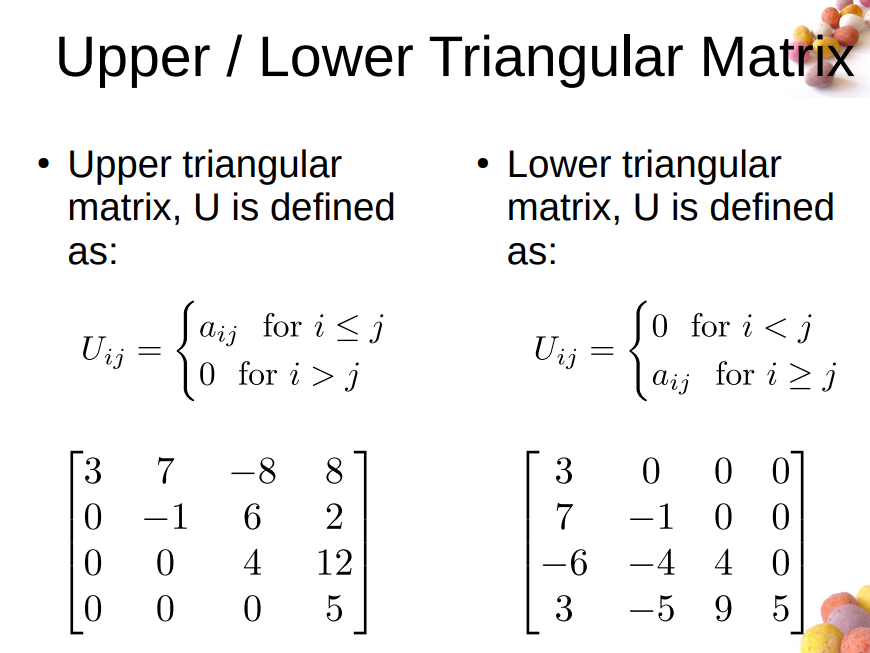

# Matrix

Rows & Columns

$$
\begin{bmatrix} 3 & 2 & \frac13\\ 6 & 0 & -1 \end{bmatrix} \rightarrow \begin{bmatrix} a_{11}&a_{12}&a_{13}\\ a_{21}&a_{22}&a_{23} \end{bmatrix}
$$

Two matrix are the equal only if they have the same dimension and corresponding entries are the equal.

$$
3 \begin{bmatrix} 1 & 3 &5\\ -1&0.5&3 \end{bmatrix} = \begin{bmatrix} 3&9&15\\ -3&1.5&9 \end{bmatrix}
$$

matrix multiplication

A is m$\times$n

B is n$\times$p

get m$\times$p

$A\times B\neq B\times A$

!\[image-20221219143458673]\(./assets/lecture 6\_1.png)

$(A+B)C=AC+BC$

$|A^T|=|A|$
