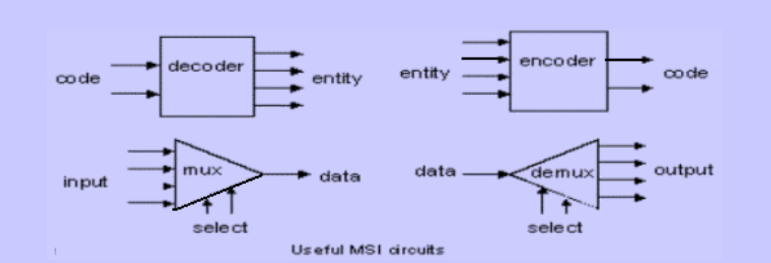
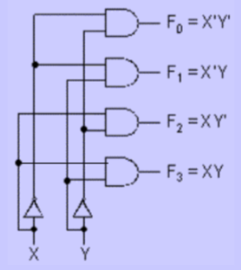
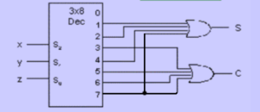
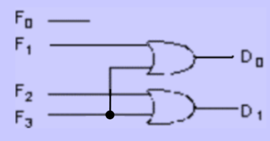
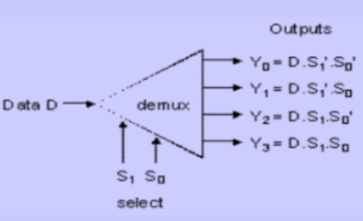
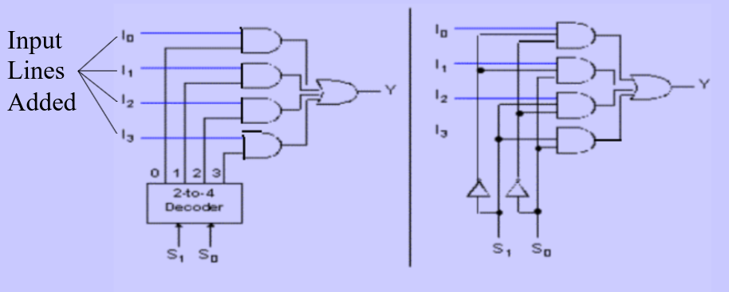

# Combinational Circuit - MSI Circuit

## Decoder

tell you the oct of the bin input

> input = 1,0; F~2~=1    $(10)_2=(2)_{10}$

- example

  

  input = 1,1,1; output=1,1

  > $(111)_2=(7)_{10}$ 

## Encoder

tell you which input is 1 (oct to bin ) , if there are one more 1 in the input, the result is don’t care

> input = 0,1,0,0; output=0,1

## Demultiplexer

only the choosed output will give D, others are 0

## Multiplexer

$Z=(A S_0' S_1')(BS_0'S_1 )(CS_0S_1')(DS_0S_1)$