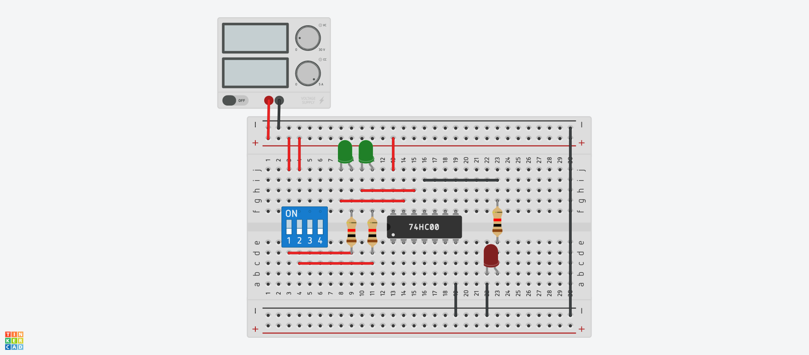
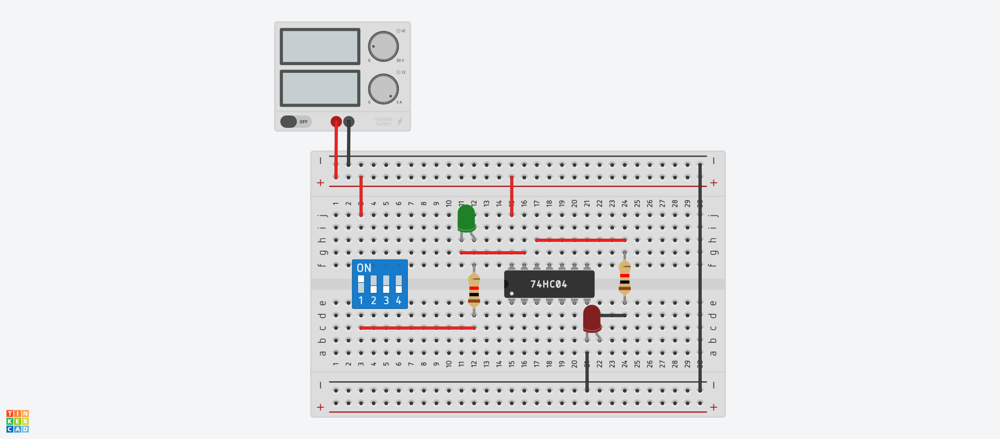
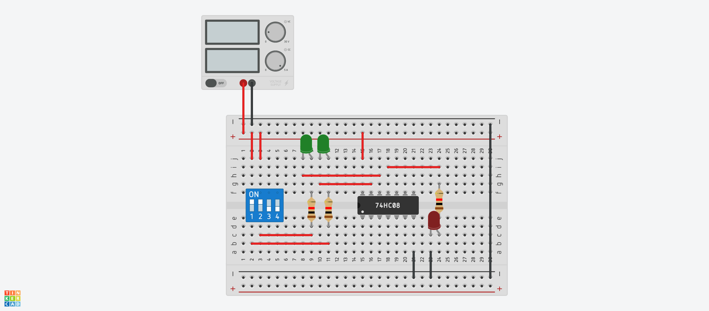
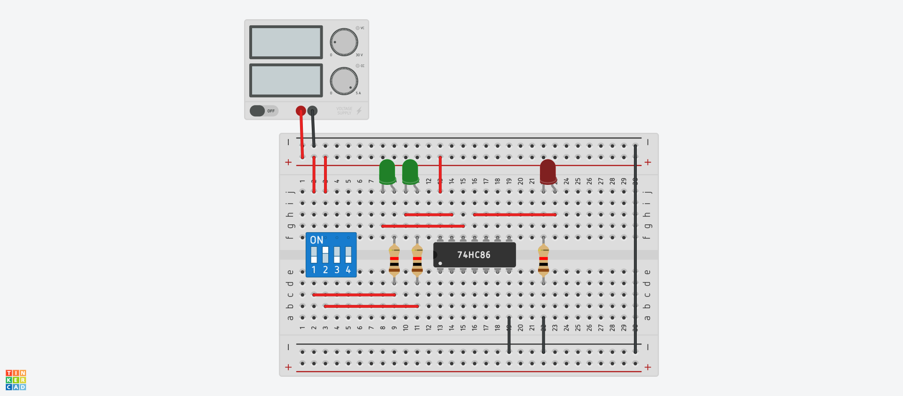
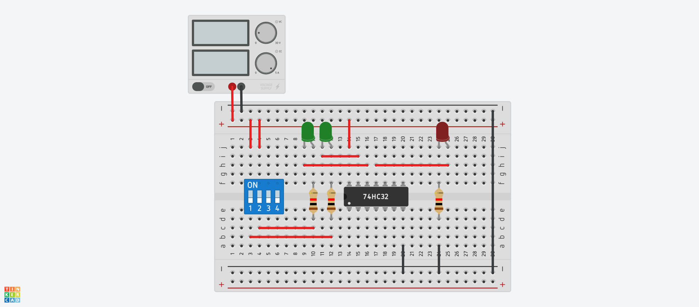

# lab 1

## 74LS00

| Input A | Input B | Output |
| ------- | ------- | ------ |
| 0       | 0       | 1      |
| 0       | 1       | 1      |
| 1       | 0       | 1      |
| 1       | 1       | 0      |

## 74LS04

| Input | Output |
| ----- | ------ |
| 0     | 1      |
| 1     | 0      |

## 74LS08

| Input A | Input B | Output |
| ------- | ------- | ------ |
| 0       | 0       | 0      |
| 0       | 1       | 0      |
| 1       | 0       | 0      |
| 1       | 1       | 1      |

## 74LS86

| Input A | Input B | Output |
| ------- | ------- | ------ |
| 0       | 0       | 0      |
| 0       | 1       | 1      |
| 1       | 0       | 1      |
| 1       | 1       | 0      |

## 74LS32

| Input A | Input B | Output |
| ------- | ------- | ------ |
| 0       | 0       | 1      |
| 0       | 1       | 0      |
| 1       | 0       | 0      |
| 1       | 1       | 1      |

